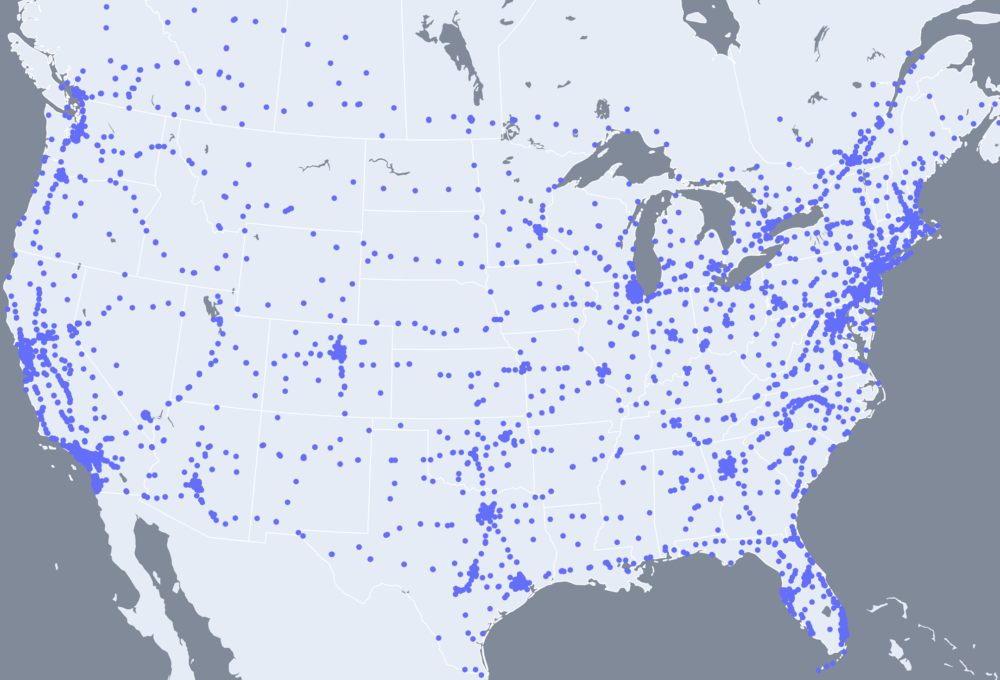
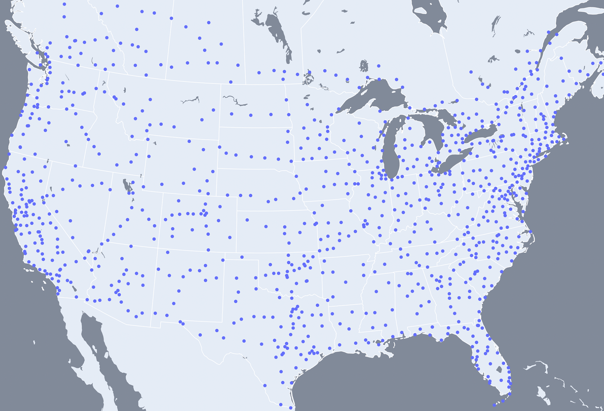
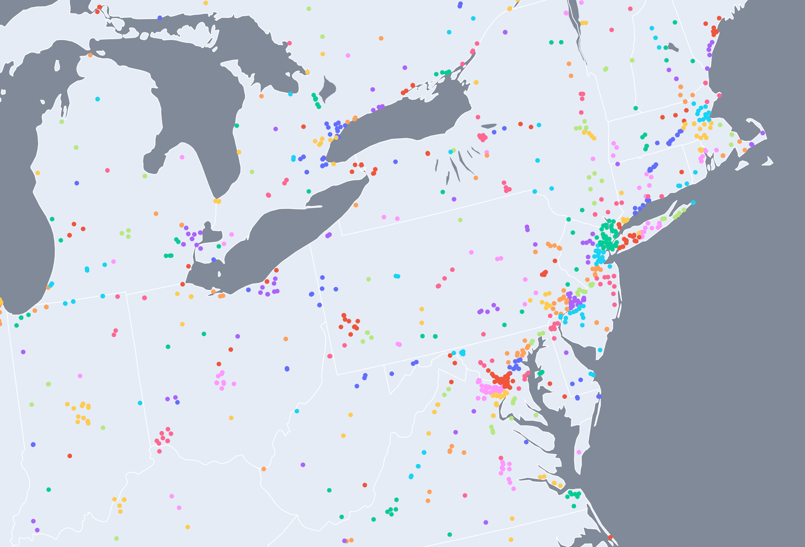
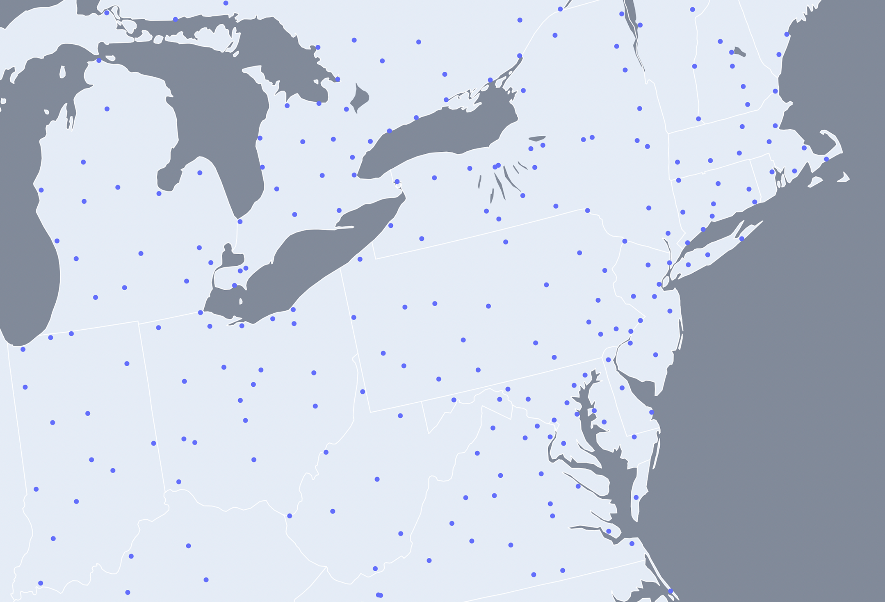

# evsim
The general idea for this project is to calculate routes that stop at charge stations as needed for EVs to complete long trips in mainland North America. Currently, the start and end points must be charge stations, and user inputted coordinates are snapped to the nearest charge stations before any calculations are done. After this, the route which minimizes total drive time is found and the EV's battery level is simulated. All backend code is written in Python.

# Logic Implementation

Data for this project is retrieved from 2 places.
* [US Dept. of Energy's Electric Vehicle Charging Station Locations](https://afdc.energy.gov/fuels/electricity_locations.html#/analyze?fuel=ELEC) via CSV download[^1]
[^1]: Currently only charge stations with at least 4 DC fast chargers located in mainland NA are used.
* [Google Map's Directions API](https://developers.google.com/maps/documentation/directions/overview) via the [Python Client for Google Maps Services](https://github.com/googlemaps/google-maps-services-python)

Routing an EV trip that is longer than the EV's range involves stopping at 1 or more charge stations during the trip to recharge the EV's battery. To limit API calls needed when routing an EV trip, a "charge network" is initially created as a local offline cache of possible routes. More specifically, a charge network is a weighted [graph](https://en.wikipedia.org/wiki/Graph_(discrete_mathematics)) where the vertices are charge stations and the edges are possible legs between charge stations weighted by drive time.


## Clustering

To limit the complexity of the charge network without drastically changing its functionality, charge stations are clustered into groups contained within a certain diameter[^2] and then replaced by each group's most central charge station. This is implemented recursively using a divisive [hierarchical clustering
](https://en.wikipedia.org/wiki/Hierarchical_clustering) tree.
[^2] Currently this is 60km.

Initial Charge Network (n=3606) | Clustered Charge Network (n=942)
--- | ---
 | 

Clusters in Initial Charge Network Zoomed | Clustered Charge Network Zoomed
--- | ---
 | 

## Possible Legs

A possible leg is defined as a leg which has a road distance less than the max supported EV range of the charge network[^3]. To initially populate the charge network with all possible legs, an API call must be made for each leg to compare road distance to the max supported EV range of the charge network. Using great circle distance between two charge stations as a heuristic makes the number of API calls needed feasible; an API call is only needed if the great circle distance is less than the max supported EV range of the charge network since the road distance is certainly greater than the great circle distance.
[^3] Currently this is 700km.

## Routing

Given that the charge network represents all possible legs for the EV, routing from one charge station to another simplifies to the single-pair [shortest path problem](https://en.wikipedia.org/wiki/Shortest_path_problem). This is solved using the [A* search algorithm](https://en.wikipedia.org/wiki/A*_search_algorithm) with great circle distance heuristic implemented using a fringe priority queue and hash set for constant time membership checking at the expense of space complexity.

## Simulating Battery

After a route has been found, the start battery of the EV is initialized based on the user input. Battery depletion is simulated linearly with road distance. Battery charging is simulated following a non-linear regression of current battery technology where the charge rate diminishes as the battery approaches fully charged[^4]. With this in mind, at each charge station, the EV is only simulated to charge *just* enough to make it to the next charge station as charging more than that will be at an unoptimal charge rate.
[^4] Currently [this](https://www.desmos.com/calculator/fusfey6wwn) is the regression function used.

# Web App Implementation

The Python logic in the backend retrieves user input and serves output to the web app using the [Flask](https://flask.palletsprojects.com/) framework, along with [Jinja](https://jinja.palletsprojects.com/) interpolated HTML, and static JavaScript. Flask is also used to store user input as a cookie on form submission.

# Deployment

This project is deployed on an x86 AWS EC2 instance running AL2023. The Flask app is run in a Python 3.11 venv using the WSGI HTTP server [Gunicorn](https://gunicorn.org/) which is run behind [Nginx](https://docs.nginx.com/nginx/admin-guide/web-server/reverse-proxy/) configured as a HTTP reverse proxy server (recommended by Gunicorn). SSL certificates are created and renewed using [Certbot](https://certbot.eff.org/) in its own venv.

The following commands were used.

```shell
sudo dnf install git
git clone https://github.com/skrukwa/ev-trip-sim.git
```
```shell
sudo dnf install python3.11
python3.11 -m venv
```
``` shell
sudo dnf install nginx

sudo nano /etc/nginx/conf.d/main.conf

# server {
#     server_name www.evsim.ca evsim.ca;
#     location / {
#         proxy_pass http://0.0.0.0:5000;
#     }
# }
```
```shell
sudo python3 -m venv /opt/certbot/
sudo /opt/certbot/bin/pip install certbot certbot-nginx
sudo ln -s /opt/certbot/bin/certbot /usr/bin/certbot
sudo certbot --nginx

echo "0 0,12 * * * root /opt/certbot/bin/python -c 'import random; import time; time.sleep(random.random() * 3600)' && sudo certbot renew -q" | sudo tee -a /etc/crontab > /dev/null
```
```shell
sudo systemctl start nginx  # start nginx

gunicorn --chdir /home/ec2-user/ev-trip-sim --bind 0.0.0.0:5000 wsgi:app  # start gunicorn (from 3.11 venv)
```